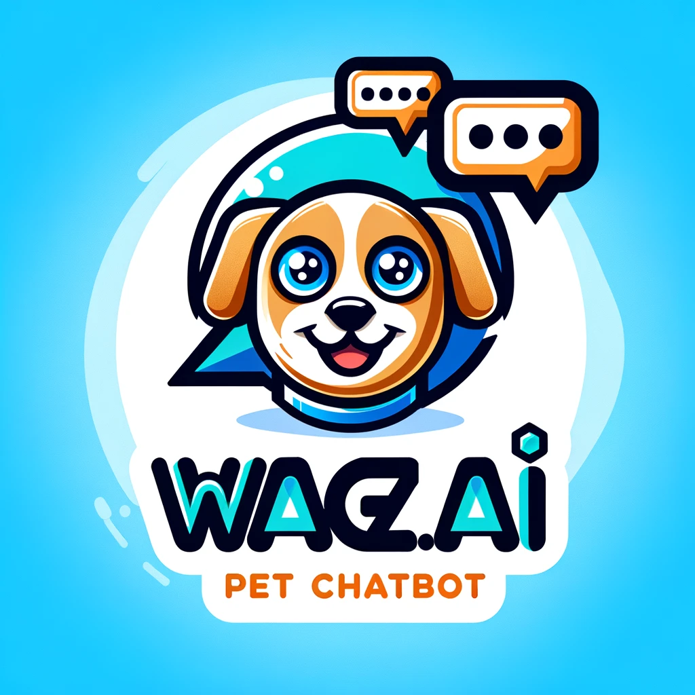

# Pet Chatbot

This is a simple chatbot for providing information about pets. The application is built using Flask and leverages a simple natural language processing (NLP) function to generate responses.

## Features

- Simple web interface to interact with the chatbot.
- Provides information about various pets.
- Built with Flask and a custom NLP processing module.

## Requirements

- Python 3.9+
- Flask
- Transformers (for NLP processing)

## Installation

1. **Clone the repository:**

   ```sh
   git clone https://github.com/gconcepcion/wagzai.git
   cd wagzai
   ```

2. **Set up the virtual environment and install dependencies:**

   Using Poetry:
   ```sh
   poetry install
   ```

   If you are using venv and pip:
   ```sh
   python -m venv venv
   source venv/bin/activate
   pip install -r requirements.txt
   ```

## Running the Application

1. **Run the Flask application:**

   If you're using Poetry:

   ```sh
   poetry run python wagzai/wagz.py
   ```

   If you're using a virtual environment:

   ```sh
   source venv/bin/activate
   python pet_chatbot/app.py
   ```

2. **Open your web browser and navigate to:**

   ```
   http://127.0.0.1:5000
   ```

You should see the home page of the pet chatbot application.

## Testing

To run the tests, you can use:

Using Poetry:

   ```sh
   poetry run pytest
   ```

Using a virtual environment:

   ```sh
   source venv/bin/activate
   pytest
   ```

## Project Structure
```markdown
wagzai/
├── wagzai/
│   ├── __init__.py
│   ├── wagz.py
│   ├── nlp.py
│   ├── wagzai/
│   │   ├── __init__.py
│   │   └── wagz.py
│   ├── data/
│   │   └── pet_info.json
│   └── templates/
│       └── index.html
├── tests/
│   ├── __init__.py
│   ├── test_app.py
│   └── test_nlp.py
├── pyproject.toml
├── README.md
└── requirements.txt
```

License
This project is licensed under the Apache 2.0 License. See the [LICENSE](https://github.com/gconcepcion/wagzai/blob/main/LICENSE)  file for details.

Contributing
Contributions are welcome! Please open an issue or submit a pull request for any changes or improvements.

Contact
For any questions or issues, please contact gconcepcion@gmail.com
